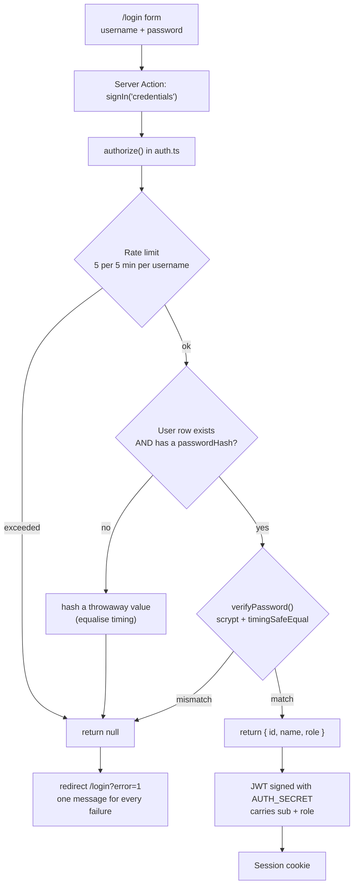
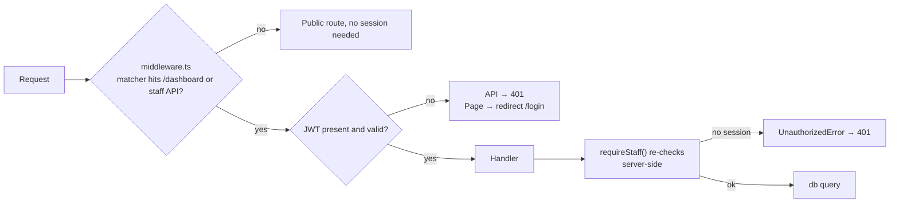
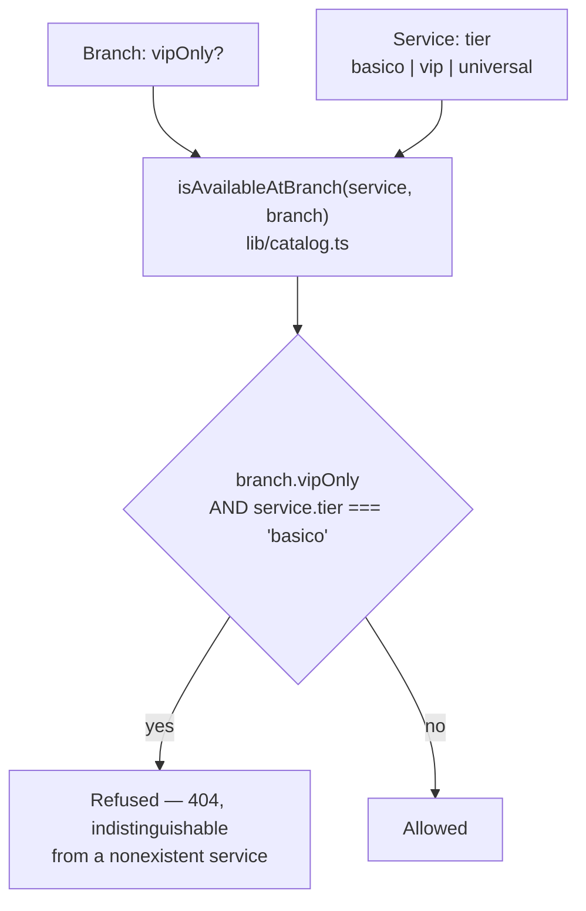
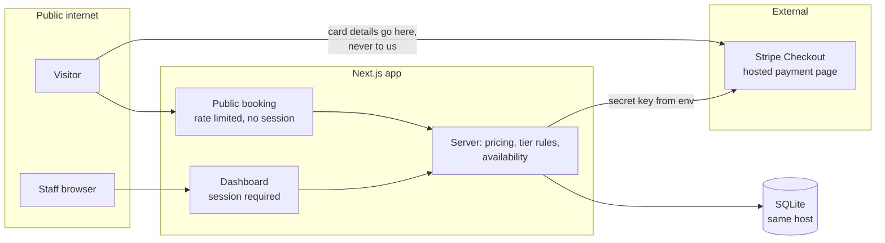

# Auth & authorization architecture

Describes what is in the repository today, after multi-tenancy and email verification
were removed and password sign-in was added.

## Two populations, one application

| | Customers | Staff |
|---|---|---|
| Accounts | **None.** Booking is anonymous | One row in `User` |
| Sign-in | n/a | Username + password |
| Reaches | `/`, `/book`, `/api/public/*` | `/dashboard/*`, `/api/{customers,appointments,services}` |
| Identity proof | none needed | scrypt hash comparison |

Customers having no accounts is a deliberate reduction of attack surface: there is no
customer credential to phish, stuff, reset, or leak. The trade-off is that a customer
cannot see or change a booking themselves — they phone the branch.

## Sign-in

**No adapter, no database sessions.** Strategy is JWT, so there is no `Session`,
`Account` or `VerificationToken` table — all three were dropped. Nothing is emailed at
any point in this flow.

## Authorization

Two independent axes. Confusing them was the mistake that made the earlier
multi-tenant removal risky, so they are stated separately.

### Axis 1 — is the caller staff?

`requireStaff()` is not redundant with middleware. Middleware runs on the Edge and can
be bypassed by anything that does not match its `matcher`; the server-side check is
what actually gates the data. It keys on the session **user id** — not email, because
staff may have no address now.

### Axis 2 — what may this branch sell?

**This is not authentication.** It is a business rule about the physical location, and
it applies identically to anonymous visitors and signed-in staff.

Called in **three** places, all the same function:

| Caller | Why it matters |
|---|---|
| `app/book/booking-form.tsx` | Hides what the branch cannot sell |
| `lib/booking.ts` | Stops a hand-crafted request; hiding a button is not a control |
| `app/dashboard/actions.ts` | Staff cannot book Regular work into the VIP branch either |

A single shared predicate is the design: three copies of this rule would drift, and the
drift would be invisible until a customer was sold something the branch does not do.

Branch scoping also governs calendars — every availability query filters `branchId`, so
Huayacán and Puerto Cancún can hold the same hour independently.

### Axis 3 — roles (declared, not enforced)

`User.role` holds `owner` or `staff`. **Nothing reads it.** Every signed-in user can
cancel bookings and activate memberships. Logged as threat **E2**; not fixed, and
listed here so the diagram does not imply a control that does not exist.

## Trust boundaries and where secrets live

| Secret | Where | Never |
|---|---|---|
| `AUTH_SECRET` | env | committed; signs the session JWT |
| `ADMIN_PASSWORD` | env, hashed at seed time | stored in reversible form |
| `STRIPE_SECRET_KEY` | env, read at call time | logged, or sent to the browser |

**Card data never enters this application.** Stripe hosts the payment page; the app
receives an opaque session id and a URL.

## What the browser is never trusted with

| Input | Handling |
|---|---|
| Prices, totals | No schema accepts an amount. Computed server-side from stored rows. |
| Which services exist at a branch | Re-checked server-side with the same predicate the UI uses. |
| Whether a slot is free | Re-derived on submission; the offered list is a convenience. |
| Add-on ids | Re-read with `kind: "extra"` enforced. |
| Stripe return URLs | `origin` taken from the request, never the body. |
| Any unexpected field | Every Zod schema is `.strict()` — a surprise key is a 422. |

## Known architectural gaps

Carried from `threat-model.md` so this document is not read as a clean bill of health.

| Gap | Effect |
|---|---|
| No Stripe webhook | Bookings stay `pending` whether or not payment succeeded; revenue figures can diverge from reality |
| `role` unenforced | No separation between owner and staff |
| `AuditLog` has no writer | No record of who cancelled what |
| Rate limiter in-memory | Per-process; multiple instances multiply the budget |
| `x-forwarded-for` trusted | Booking limiter is defeatable without a trusted proxy in front |
